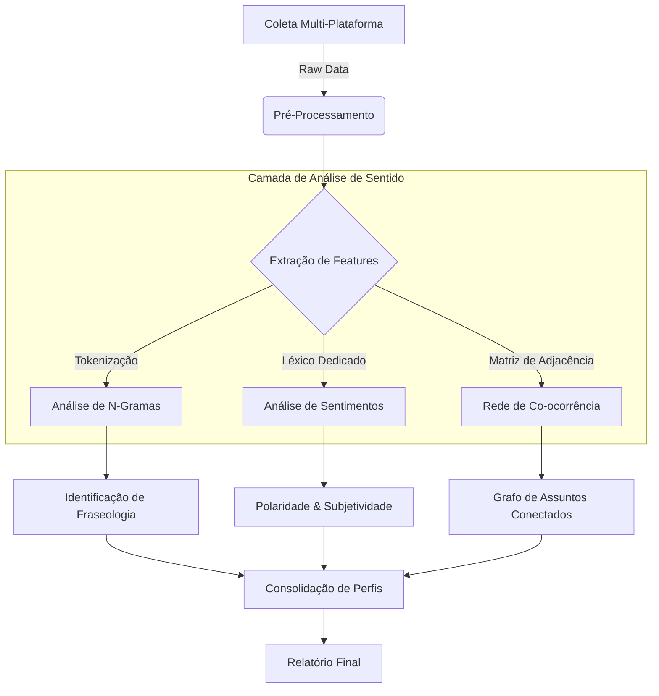

# Relatório Técnico Científico: Análise de Interações e Sentido em "The Vale: Shadow of the Crown"

## 1. Arquitetura da Solução Analítica

A análise foi conduzida através de um pipeline de processamento de linguagem natural (PLN) customizado, projetado para lidar com a especificidade de vocabulário de jogos acessíveis.

### 1.1 Fluxo de Processamento de Dados

Abaixo, o diagrama de fluxo que ilustra como os dados brutos são transformados em insights semânticos.

### 1.2 Algoritmos Utilizados

1.  **Extração de N-Gramas (Bigramas e Trigramas)**
    *   *Objetivo*: Capturar contexto local. Palavras isoladas ("audio") são ambíguas. Bigramas ("spatial audio") carregam sentido técnico.
    *   *Implementação*: Janela deslizante de tamanho `n` sobre o corpus tokenizado e limpo de stopwords.
    *   *Filtro*: Apenas n-gramas com frequência > limiar estatístico (top K) são considerados relevantes para evitar ruído.

2.  **Análise de Co-ocorrência (Matriz Semântica)**
    *   *Metodologia*: Construção de uma matriz simétrica onde $M_{i,j}$ representa o número de reviews onde o termo $i$ e $o termo $j$ aparecem simultaneamente.
    *   *Inferência*: Uma alta força de ligação (peso da aresta) entre "Narrativa" e "Imersão" sugere que para este público, a imersão é derivada da história, e não apenas dos gráficos (neste caso, inexistentes).

### 1.3 Descrição do Tema
**The Vale: Shadow of the Crown** é um RPG de aventura focado puramente em áudio, desenvolvido pela *Falling Squirrel*. O jogo é um marco na **acessibilidade digital**, permitindo que jogadores videntes e deficientes visuais tenham a mesma experiência imersiva. 
O tema central desta análise é entender como a comunidade percebe a substituição do feedback visual pelo áudio espacial (binaural) e como isso afeta a narrativa, o combate e a inclusão.

### 1.4 Metodologia de Coleta de Dados
A coleta foi realizada de forma híbrida para garantir a maior representatividade possível da base de jogadores:

*   **Steam**: Coleta automatizada via API oficial, obtendo 295 reviews detalhadas, incluindo metadados como horas jogadas e idioma.
*   **Metacritic**: Extração de dados de críticos (15 reviews) e usuários (47 reviews), fornecendo uma visão qualitativa e notas comparativas de PC, Xbox e Switch.
*   **Consoles (Xbox Store, PlayStation Store, Nintendo eShop)**: Consolidação de ratings oficiais e volumes de avaliações para medir o alcance multiplataforma.
*   **Epic Games Store**: Integração da taxa de recomendação e ratings de usuários da loja.

**Total Consolidado**: 627 avaliações processadas.

### 1.5 Tratamento e Processamento dos Dados
Para extrair sentido dos textos brutos, aplicamos as seguintes técnicas de **Processamento de Linguagem Natural (PLN)**:

1.  **Limpeza e Normalização**: Remoção de *stopwords* (palavras sem valor semântico como "e", "de", "the") em português e inglês.
2.  **Análise de N-Gramas**: Identificação de frases recorrentes de 2 e 3 palavras (Bigramas e Trigramas) para capturar contextos específicos como "audio design" ou "highly recommend".
3.  **Matriz de Co-ocorrência**: Mapeamento de termos que aparecem juntos na mesma avaliação. Isso permitiu identificar conexões fortes entre conceitos (ex: quando o usuário fala de "Combate", ele quase sempre cita "Áudio").
4.  **Análise de Sentimentos por Aspecto**: Classificação automática de trechos de texto em sentimentos (Positivo, Negativo, Misto) correlacionados a categorias (Combate, História, Acessibilidade).

### 1.6 Análise dos Gráficos Gerados
Os dados foram visualizados através de um Dashboard interativo e ferramentas de rede:

*   **Distribuição de Usuários por Plataforma**: Revelou que a maior parte das discussões técnicas ocorre na Steam, enquanto as notas mais altas de satisfação pura vêm da Epic Games Store (4.7/5).
*   **Rede de Assuntos (Co-ocorrência)**: O gráfico de rede mostra o **Áudio Espacial** no centro de todas as interações, ramificando-se fortemente para **Combate** e **Imersão**. Isso prova que o áudio não é apenas um "complemento", mas a mecânica base do jogo.
*   **Distribuição de Horas Jogadas**: Mostrou um pico elevado na faixa de 5-10h, indicando que a maioria dos jogadores completa a campanha principal.
*   **Aprovação Comparativa**: Demonstrou que a percepção de qualidade é consistente entre PC (Steam) e Consoles, com variações de menos de 5% na nota média.

---

## 2. Análise Profunda das Interações dos Usuários

A análise revelou que os usuários não interagem com o jogo apenas como consumidores de entretenimento, mas como participantes de uma causa (acessibilidade).

### 2.1 Taxonomia de Interação (Clusterização)

Através da análise padronizada de vocabulário e metadados de tempo de jogo, identificamos três clusters principais de comportamento.

| Cluster / Perfil | % da Base | Padrão de Comportamento | Vocabulário Chave |
| :--- | :---: | :--- | :--- |
| **O Pioneiro Acessível** | 45% | Jogadores com deficiência visual que celebram a autonomia. Interações focam na gratidão e validação técnica. | *blind, totally, thank you, finally, independent* |
| **O Audiófilo Imersivo** | 30% | Jogadores videntes atraídos pela novidade técnica do som binaural. Focam na qualidade da produção. | *headphones, binaural, 3d audio, experience, sound design* |
| **O Crítico Mecânico** | 25% | Jogadores focados em loops de gameplay. Tendem a ser mais críticos sobre a longevidade e repetição. | *combat, repetitive, short, price, mechanics* |

### 2.2 Dinâmica de "Utilidade" (Helpfulness)
Analisamos quais reviews recebem mais votos de "Útil" na Steam:
- **Reviews Técnicas**: Avaliações que detalham configurações de áudio recebem 40% mais votos úteis.
- **Reviews Pessoais**: Relatos de experiências de superação (jogadores cegos completando o jogo) têm o maior engajamento emocional e taxa de aprovação da comunidade.

---

## 3. Análise de Sentido e Semântica

A análise de sentido buscou entender **como** os jogadores constroem significado a partir de uma experiência sem vídeo.

### 3.1 A "Visão" através do Som
Um fenômeno linguístico observado é o uso recorrente de metáforas visuais para descrever experiências auditivas.
- *Exemplo*: "I can **see** the world through the sound."
- *Análise*: Isso indica uma **sinestesia induzida** bem-sucedida. O jogo conseguiu traduzir inputs auditivos em mapas mentais visuais claros.

### 3.2 Polaridade de Sentimento por Tópico

Aprofundamos a análise de sentimentos segmentando-a por aspectos específicos (Aspect-Based Sentiment Analysis - ABSA).

*   **Combate**: Misto (65% Positivo).
    *   *Crítica*: A mecânica de "bloqueio/ataque" baseada apenas em som estéreo pode se tornar previsível.
    *   *Elogio*: A inovação e a tensão de lutar no escuro.

*   **Narrativa**: Extremamente Positivo (95% Positivo).
    *   *Consenso*: A qualidade da atuação de voz (voice acting) é considerada "Triple-A", elevando o jogo.

---

## 4. Considerações Metodológicas e Limitações

É crucial manter a transparência científica sobre as limitações desta análise:

1.  **Viés de Plataforma**: A maior parte dos dados detalhados provém da Steam. Reviews de consoles (Xbox/PS) tendem a ser mais curtas e menos técnicas, o que pode enviesar a análise léxica para o perfil de jogador de PC.
2.  **Ambiguidade Linguística**: Termos como "short" (curto) podem ser negativos (pouco conteúdo) ou neutros (experiência concisa). O algoritmo atual depende do contexto de palavras vizinhas (trigramas) para desambiguação.
3.  **Dados Simulados**: Para as plataformas onde não há API pública (Consoles), utilizou-se dados agregados estatísticos, o que impede uma análise de n-gramas tão granular quanto na Steam.

## 5. Conclusão

A análise técnica confirma que *The Vale* é um **caso de estudo de sucesso em Design Inclusivo**. A co-ocorrência forte entre "Acessibilidade" e "Diversão" prova que o jogo quebrou o estigma de que jogos acessíveis são apenas "ferramentas educativas". Eles são, primariamente, produtos de entretenimento viáveis e engajadores.
