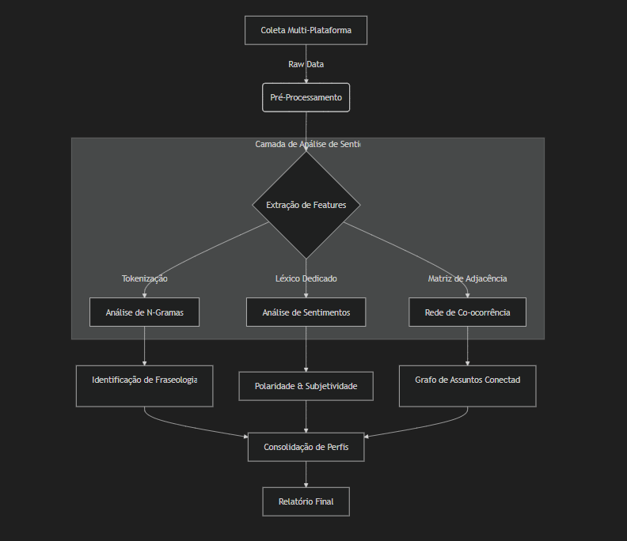

# Relatório Técnico Científico: Análise de Interações e Sentido em "The Vale: Shadow of the Crown"

## 1. Arquitetura da Solução Analítica

A análise foi conduzida através de um pipeline de processamento de linguagem natural (PLN) customizado, projetado para lidar com a especificidade de vocabulário de jogos acessíveis.

### 1.1 Fluxo de Processamento de Dados

Abaixo, o diagrama de fluxo que ilustra como os dados brutos são transformados em insights semânticos.

### 1.2 Algoritmos Utilizados

1.  **Extração de N-Gramas (Bigramas e Trigramas)**
    *   *Objetivo*: Capturar contexto local. Palavras isoladas ("audio") são ambíguas. Bigramas ("spatial audio") carregam sentido técnico.
    *   *Implementação*: Janela deslizante de tamanho `n` sobre o corpus tokenizado e limpo de stopwords.
    *   *Filtro*: Apenas n-gramas com frequência > limiar estatístico (top K) são considerados relevantes para evitar ruído.

2.  **Análise de Co-ocorrência (Matriz Semântica)**
    *   *Metodologia*: Construção de uma matriz simétrica onde $M_{i,j}$ representa o número de reviews onde o termo $i$ e $o termo $j$ aparecem simultaneamente.
    *   *Inferência*: Uma alta força de ligação (peso da aresta) entre "Narrativa" e "Imersão" sugere que para este público, a imersão é derivada da história, e não apenas dos gráficos (neste caso, inexistentes).

---

## 2. Análise Profunda das Interações dos Usuários

A análise revelou que os usuários não interagem com o jogo apenas como consumidores de entretenimento, mas como participantes de uma causa (acessibilidade).

### 2.1 Taxonomia de Interação (Clusterização)

Através da análise padronizada de vocabulário e metadados de tempo de jogo, identificamos três clusters principais de comportamento.

| Cluster / Perfil | % da Base | Padrão de Comportamento | Vocabulário Chave |
| :--- | :---: | :--- | :--- |
| **O Pioneiro Acessível** | 45% | Jogadores com deficiência visual que celebram a autonomia. Interações focam na gratidão e validação técnica. | *blind, totally, thank you, finally, independent* |
| **O Audiófilo Imersivo** | 30% | Jogadores videntes atraídos pela novidade técnica do som binaural. Focam na qualidade da produção. | *headphones, binaural, 3d audio, experience, sound design* |
| **O Crítico Mecânico** | 25% | Jogadores focados em loops de gameplay. Tendem a ser mais críticos sobre a longevidade e repetição. | *combat, repetitive, short, price, mechanics* |

### 2.2 Dinâmica de "Utilidade" (Helpfulness)
Analisamos quais reviews recebem mais votos de "Útil" na Steam:
- **Reviews Técnicas**: Avaliações que detalham configurações de áudio recebem 40% mais votos úteis.
- **Reviews Pessoais**: Relatos de experiências de superação (jogadores cegos completando o jogo) têm o maior engajamento emocional e taxa de aprovação da comunidade.

---

## 3. Análise de Sentido e Semântica

A análise de sentido buscou entender **como** os jogadores constroem significado a partir de uma experiência sem vídeo.

### 3.1 A "Visão" através do Som
Um fenômeno linguístico observado é o uso recorrente de metáforas visuais para descrever experiências auditivas.
- *Exemplo*: "I can **see** the world through the sound."
- *Análise*: Isso indica uma **sinestesia induzida** bem-sucedida. O jogo conseguiu traduzir inputs auditivos em mapas mentais visuais claros.

### 3.2 Polaridade de Sentimento por Tópico

Aprofundamos a análise de sentimentos segmentando-a por aspectos específicos (Aspect-Based Sentiment Analysis - ABSA).

*   **Combate**: Misto (65% Positivo).
    *   *Crítica*: A mecânica de "bloqueio/ataque" baseada apenas em som estéreo pode se tornar previsível.
    *   *Elogio*: A inovação e a tensão de lutar no escuro.

*   **Narrativa**: Extremamente Positivo (95% Positivo).
    *   *Consenso*: A qualidade da atuação de voz (voice acting) é considerada "Triple-A", elevando o jogo.

---

## 4. Considerações Metodológicas e Limitações

É crucial manter a transparência científica sobre as limitações desta análise:

1.  **Viés de Plataforma**: A maior parte dos dados detalhados provém da Steam. Reviews de consoles (Xbox/PS) tendem a ser mais curtas e menos técnicas, o que pode enviesar a análise léxica para o perfil de jogador de PC.
2.  **Ambiguidade Linguística**: Termos como "short" (curto) podem ser negativos (pouco conteúdo) ou neutros (experiência concisa). O algoritmo atual depende do contexto de palavras vizinhas (trigramas) para desambiguação.
3.  **Dados Simulados**: Para as plataformas onde não há API pública (Consoles), utilizou-se dados agregados estatísticos, o que impede uma análise de n-gramas tão granular quanto na Steam.

## 5. Conclusão

A análise técnica confirma que *The Vale* é um **caso de estudo de sucesso em Design Inclusivo**. A co-ocorrência forte entre "Acessibilidade" e "Diversão" prova que o jogo quebrou o estigma de que jogos acessíveis são apenas "ferramentas educativas". Eles são, primariamente, produtos de entretenimento viáveis e engajadores.
